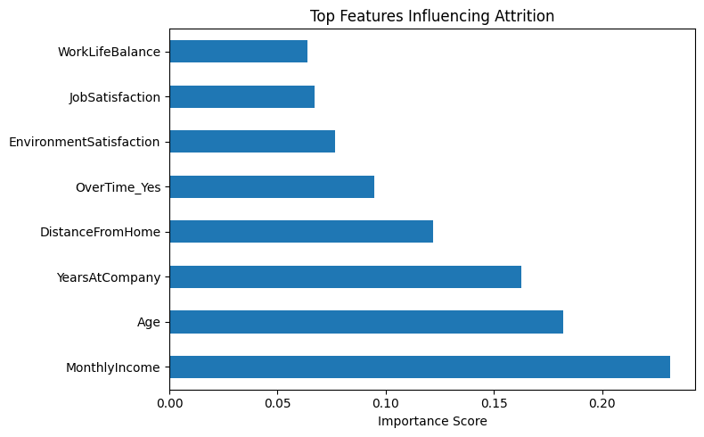
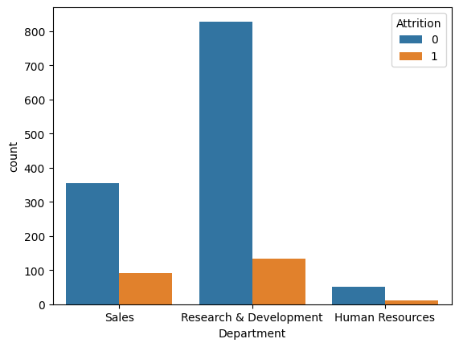
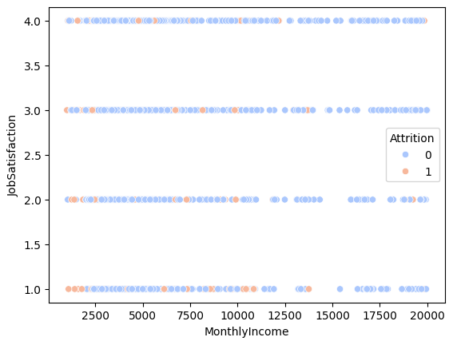

```python
import pandas as pd

# Load dataset
df = pd.read_csv("WA_Fn-UseC_-HR-Employee-Attrition.csv")

# Check first 5 rows
print(df.head())

```

       Age Attrition     BusinessTravel  DailyRate              Department  \
    0   41       Yes      Travel_Rarely       1102                   Sales   
    1   49        No  Travel_Frequently        279  Research & Development   
    2   37       Yes      Travel_Rarely       1373  Research & Development   
    3   33        No  Travel_Frequently       1392  Research & Development   
    4   27        No      Travel_Rarely        591  Research & Development   
    
       DistanceFromHome  Education EducationField  EmployeeCount  EmployeeNumber  \
    0                 1          2  Life Sciences              1               1   
    1                 8          1  Life Sciences              1               2   
    2                 2          2          Other              1               4   
    3                 3          4  Life Sciences              1               5   
    4                 2          1        Medical              1               7   
    
       ...  RelationshipSatisfaction StandardHours  StockOptionLevel  \
    0  ...                         1            80                 0   
    1  ...                         4            80                 1   
    2  ...                         2            80                 0   
    3  ...                         3            80                 0   
    4  ...                         4            80                 1   
    
       TotalWorkingYears  TrainingTimesLastYear WorkLifeBalance  YearsAtCompany  \
    0                  8                      0               1               6   
    1                 10                      3               3              10   
    2                  7                      3               3               0   
    3                  8                      3               3               8   
    4                  6                      3               3               2   
    
      YearsInCurrentRole  YearsSinceLastPromotion  YearsWithCurrManager  
    0                  4                        0                     5  
    1                  7                        1                     7  
    2                  0                        0                     0  
    3                  7                        3                     0  
    4                  2                        2                     2  
    
    [5 rows x 35 columns]
    


```python
# Basic info
df.info()

# Summary statistics
df.describe()

# Check missing values
df.isnull().sum()

```

    <class 'pandas.core.frame.DataFrame'>
    RangeIndex: 1470 entries, 0 to 1469
    Data columns (total 35 columns):
     #   Column                    Non-Null Count  Dtype 
    ---  ------                    --------------  ----- 
     0   Age                       1470 non-null   int64 
     1   Attrition                 1470 non-null   object
     2   BusinessTravel            1470 non-null   object
     3   DailyRate                 1470 non-null   int64 
     4   Department                1470 non-null   object
     5   DistanceFromHome          1470 non-null   int64 
     6   Education                 1470 non-null   int64 
     7   EducationField            1470 non-null   object
     8   EmployeeCount             1470 non-null   int64 
     9   EmployeeNumber            1470 non-null   int64 
     10  EnvironmentSatisfaction   1470 non-null   int64 
     11  Gender                    1470 non-null   object
     12  HourlyRate                1470 non-null   int64 
     13  JobInvolvement            1470 non-null   int64 
     14  JobLevel                  1470 non-null   int64 
     15  JobRole                   1470 non-null   object
     16  JobSatisfaction           1470 non-null   int64 
     17  MaritalStatus             1470 non-null   object
     18  MonthlyIncome             1470 non-null   int64 
     19  MonthlyRate               1470 non-null   int64 
     20  NumCompaniesWorked        1470 non-null   int64 
     21  Over18                    1470 non-null   object
     22  OverTime                  1470 non-null   object
     23  PercentSalaryHike         1470 non-null   int64 
     24  PerformanceRating         1470 non-null   int64 
     25  RelationshipSatisfaction  1470 non-null   int64 
     26  StandardHours             1470 non-null   int64 
     27  StockOptionLevel          1470 non-null   int64 
     28  TotalWorkingYears         1470 non-null   int64 
     29  TrainingTimesLastYear     1470 non-null   int64 
     30  WorkLifeBalance           1470 non-null   int64 
     31  YearsAtCompany            1470 non-null   int64 
     32  YearsInCurrentRole        1470 non-null   int64 
     33  YearsSinceLastPromotion   1470 non-null   int64 
     34  YearsWithCurrManager      1470 non-null   int64 
    dtypes: int64(26), object(9)
    memory usage: 402.1+ KB
    


    Age                         0
    Attrition                   0
    BusinessTravel              0
    DailyRate                   0
    Department                  0
    DistanceFromHome            0
    Education                   0
    EducationField              0
    EmployeeCount               0
    EmployeeNumber              0
    EnvironmentSatisfaction     0
    Gender                      0
    HourlyRate                  0
    JobInvolvement              0
    JobLevel                    0
    JobRole                     0
    JobSatisfaction             0
    MaritalStatus               0
    MonthlyIncome               0
    MonthlyRate                 0
    NumCompaniesWorked          0
    Over18                      0
    OverTime                    0
    PercentSalaryHike           0
    PerformanceRating           0
    RelationshipSatisfaction    0
    StandardHours               0
    StockOptionLevel            0
    TotalWorkingYears           0
    TrainingTimesLastYear       0
    WorkLifeBalance             0
    YearsAtCompany              0
    YearsInCurrentRole          0
    YearsSinceLastPromotion     0
    YearsWithCurrManager        0
    dtype: int64


```python
# Drop duplicates
df.drop_duplicates(inplace=True)

# Convert 'Attrition' and 'OverTime' (Yes/No) to numeric 1/0
df['Attrition'] = df['Attrition'].map({'Yes': 1, 'No': 0})
df['OverTime']  = df['OverTime'].map({'Yes': 1, 'No': 0})

# Convert all other object columns to 'category' type
for col in df.select_dtypes('object').columns:
    df[col] = df[col].astype('category')

```


```python
# Correlation between selected features (numeric only)
corr_features = ['Attrition', 'Age', 'MonthlyIncome', 'JobSatisfaction', 'OverTime', 'YearsAtCompany']
print(df[corr_features].corr())


```

                     Attrition       Age  MonthlyIncome  JobSatisfaction  \
    Attrition              NaN       NaN            NaN              NaN   
    Age                    NaN  1.000000       0.497855        -0.004892   
    MonthlyIncome          NaN  0.497855       1.000000        -0.007157   
    JobSatisfaction        NaN -0.004892      -0.007157         1.000000   
    OverTime               NaN  0.028062       0.006089         0.024539   
    YearsAtCompany         NaN  0.311309       0.514285        -0.003803   
    
                     OverTime  YearsAtCompany  
    Attrition             NaN             NaN  
    Age              0.028062        0.311309  
    MonthlyIncome    0.006089        0.514285  
    JobSatisfaction  0.024539       -0.003803  
    OverTime         1.000000       -0.011687  
    YearsAtCompany  -0.011687        1.000000  
    


```python
df.to_csv("cleaned_hr_data.csv", index=False)
print("✅ Cleaned dataset saved as 'cleaned_hr_data.csv'")

```

    ✅ Cleaned dataset saved as 'cleaned_hr_data.csv'
    


```python
!pip install sqlalchemy


```

    Collecting sqlalchemy
      Downloading sqlalchemy-2.0.44-cp312-cp312-win_amd64.whl.metadata (9.8 kB)
    Collecting greenlet>=1 (from sqlalchemy)
      Downloading greenlet-3.2.4-cp312-cp312-win_amd64.whl.metadata (4.2 kB)
    Requirement already satisfied: typing-extensions>=4.6.0 in c:\users\chand\appdata\local\programs\python\python312\lib\site-packages (from sqlalchemy) (4.12.2)
    Downloading sqlalchemy-2.0.44-cp312-cp312-win_amd64.whl (2.1 MB)
       ---------------------------------------- 0.0/2.1 MB ? eta -:--:--
       ---- ----------------------------------- 0.3/2.1 MB ? eta -:--:--
       ---------------------------------------  2.1/2.1 MB 8.4 MB/s eta 0:00:01
       ---------------------------------------- 2.1/2.1 MB 7.1 MB/s eta 0:00:00
    Downloading greenlet-3.2.4-cp312-cp312-win_amd64.whl (299 kB)
    Installing collected packages: greenlet, sqlalchemy
    
       ---------------------------------------- 0/2 [greenlet]
       ---------------------------------------- 0/2 [greenlet]
       ---------------------------------------- 0/2 [greenlet]
       ---------------------------------------- 0/2 [greenlet]
       -------------------- ------------------- 1/2 [sqlalchemy]
       -------------------- ------------------- 1/2 [sqlalchemy]
       -------------------- ------------------- 1/2 [sqlalchemy]
       -------------------- ------------------- 1/2 [sqlalchemy]
       -------------------- ------------------- 1/2 [sqlalchemy]
       -------------------- ------------------- 1/2 [sqlalchemy]
       -------------------- ------------------- 1/2 [sqlalchemy]
       -------------------- ------------------- 1/2 [sqlalchemy]
       -------------------- ------------------- 1/2 [sqlalchemy]
       -------------------- ------------------- 1/2 [sqlalchemy]
       -------------------- ------------------- 1/2 [sqlalchemy]
       -------------------- ------------------- 1/2 [sqlalchemy]
       -------------------- ------------------- 1/2 [sqlalchemy]
       -------------------- ------------------- 1/2 [sqlalchemy]
       -------------------- ------------------- 1/2 [sqlalchemy]
       -------------------- ------------------- 1/2 [sqlalchemy]
       -------------------- ------------------- 1/2 [sqlalchemy]
       -------------------- ------------------- 1/2 [sqlalchemy]
       -------------------- ------------------- 1/2 [sqlalchemy]
       -------------------- ------------------- 1/2 [sqlalchemy]
       -------------------- ------------------- 1/2 [sqlalchemy]
       -------------------- ------------------- 1/2 [sqlalchemy]
       -------------------- ------------------- 1/2 [sqlalchemy]
       -------------------- ------------------- 1/2 [sqlalchemy]
       -------------------- ------------------- 1/2 [sqlalchemy]
       -------------------- ------------------- 1/2 [sqlalchemy]
       -------------------- ------------------- 1/2 [sqlalchemy]
       -------------------- ------------------- 1/2 [sqlalchemy]
       -------------------- ------------------- 1/2 [sqlalchemy]
       -------------------- ------------------- 1/2 [sqlalchemy]
       -------------------- ------------------- 1/2 [sqlalchemy]
       -------------------- ------------------- 1/2 [sqlalchemy]
       -------------------- ------------------- 1/2 [sqlalchemy]
       -------------------- ------------------- 1/2 [sqlalchemy]
       -------------------- ------------------- 1/2 [sqlalchemy]
       -------------------- ------------------- 1/2 [sqlalchemy]
       -------------------- ------------------- 1/2 [sqlalchemy]
       -------------------- ------------------- 1/2 [sqlalchemy]
       -------------------- ------------------- 1/2 [sqlalchemy]
       -------------------- ------------------- 1/2 [sqlalchemy]
       -------------------- ------------------- 1/2 [sqlalchemy]
       -------------------- ------------------- 1/2 [sqlalchemy]
       -------------------- ------------------- 1/2 [sqlalchemy]
       -------------------- ------------------- 1/2 [sqlalchemy]
       -------------------- ------------------- 1/2 [sqlalchemy]
       -------------------- ------------------- 1/2 [sqlalchemy]
       -------------------- ------------------- 1/2 [sqlalchemy]
       -------------------- ------------------- 1/2 [sqlalchemy]
       -------------------- ------------------- 1/2 [sqlalchemy]
       -------------------- ------------------- 1/2 [sqlalchemy]
       -------------------- ------------------- 1/2 [sqlalchemy]
       -------------------- ------------------- 1/2 [sqlalchemy]
       -------------------- ------------------- 1/2 [sqlalchemy]
       -------------------- ------------------- 1/2 [sqlalchemy]
       -------------------- ------------------- 1/2 [sqlalchemy]
       -------------------- ------------------- 1/2 [sqlalchemy]
       -------------------- ------------------- 1/2 [sqlalchemy]
       -------------------- ------------------- 1/2 [sqlalchemy]
       -------------------- ------------------- 1/2 [sqlalchemy]
       -------------------- ------------------- 1/2 [sqlalchemy]
       ---------------------------------------- 2/2 [sqlalchemy]
    
    Successfully installed greenlet-3.2.4 sqlalchemy-2.0.44
    

    
    [notice] A new release of pip is available: 25.1.1 -> 25.3
    [notice] To update, run: python.exe -m pip install --upgrade pip
    


```python
from sqlalchemy import create_engine

engine = create_engine("sqlite:///workforce.db")
df.to_sql("employee_attrition", con=engine, if_exists="replace", index=False)

print("✅ Data loaded into SQLite database: workforce.db")

```

    ✅ Data loaded into SQLite database: workforce.db
    


```python
import pandas as pd
from sklearn.model_selection import train_test_split
from sklearn.ensemble import RandomForestClassifier
from sklearn.metrics import accuracy_score, confusion_matrix, classification_report
import matplotlib.pyplot as plt
import joblib
```


```python
df = pd.read_csv("WA_Fn-UseC_-HR-Employee-Attrition.csv")


```


```python
df['Attrition'] = df['Attrition'].map({'Yes': 1, 'No': 0})
```


```python
features = [
    'Age', 'MonthlyIncome', 'DistanceFromHome',
    'JobSatisfaction', 'YearsAtCompany', 'OverTime',
    'WorkLifeBalance', 'EnvironmentSatisfaction']
X = df[features]
y = df['Attrition']
```


```python
X = pd.get_dummies(X, drop_first=True)
```


```python
X_train, X_test, y_train, y_test = train_test_split(
    X, y, test_size=0.2, random_state=42, stratify=y
)
```


```python
model = RandomForestClassifier(
    n_estimators=200,
    max_depth=8,
    random_state=42,
    class_weight='balanced'
)
model.fit(X_train, y_train)
```


<style>#sk-container-id-1 {
  /* Definition of color scheme common for light and dark mode */
  --sklearn-color-text: #000;
  --sklearn-color-text-muted: #666;
  --sklearn-color-line: gray;
  /* Definition of color scheme for unfitted estimators */
  --sklearn-color-unfitted-level-0: #fff5e6;
  --sklearn-color-unfitted-level-1: #f6e4d2;
  --sklearn-color-unfitted-level-2: #ffe0b3;
  --sklearn-color-unfitted-level-3: chocolate;
  /* Definition of color scheme for fitted estimators */
  --sklearn-color-fitted-level-0: #f0f8ff;
  --sklearn-color-fitted-level-1: #d4ebff;
  --sklearn-color-fitted-level-2: #b3dbfd;
  --sklearn-color-fitted-level-3: cornflowerblue;

  /* Specific color for light theme */
  --sklearn-color-text-on-default-background: var(--sg-text-color, var(--theme-code-foreground, var(--jp-content-font-color1, black)));
  --sklearn-color-background: var(--sg-background-color, var(--theme-background, var(--jp-layout-color0, white)));
  --sklearn-color-border-box: var(--sg-text-color, var(--theme-code-foreground, var(--jp-content-font-color1, black)));
  --sklearn-color-icon: #696969;

  @media (prefers-color-scheme: dark) {
    /* Redefinition of color scheme for dark theme */
    --sklearn-color-text-on-default-background: var(--sg-text-color, var(--theme-code-foreground, var(--jp-content-font-color1, white)));
    --sklearn-color-background: var(--sg-background-color, var(--theme-background, var(--jp-layout-color0, #111)));
    --sklearn-color-border-box: var(--sg-text-color, var(--theme-code-foreground, var(--jp-content-font-color1, white)));
    --sklearn-color-icon: #878787;
  }
}

#sk-container-id-1 {
  color: var(--sklearn-color-text);
}

#sk-container-id-1 pre {
  padding: 0;
}

#sk-container-id-1 input.sk-hidden--visually {
  border: 0;
  clip: rect(1px 1px 1px 1px);
  clip: rect(1px, 1px, 1px, 1px);
  height: 1px;
  margin: -1px;
  overflow: hidden;
  padding: 0;
  position: absolute;
  width: 1px;
}

#sk-container-id-1 div.sk-dashed-wrapped {
  border: 1px dashed var(--sklearn-color-line);
  margin: 0 0.4em 0.5em 0.4em;
  box-sizing: border-box;
  padding-bottom: 0.4em;
  background-color: var(--sklearn-color-background);
}

#sk-container-id-1 div.sk-container {
  /* jupyter's `normalize.less` sets `[hidden] { display: none; }`
     but bootstrap.min.css set `[hidden] { display: none !important; }`
     so we also need the `!important` here to be able to override the
     default hidden behavior on the sphinx rendered scikit-learn.org.
     See: https://github.com/scikit-learn/scikit-learn/issues/21755 */
  display: inline-block !important;
  position: relative;
}

#sk-container-id-1 div.sk-text-repr-fallback {
  display: none;
}

div.sk-parallel-item,
div.sk-serial,
div.sk-item {
  /* draw centered vertical line to link estimators */
  background-image: linear-gradient(var(--sklearn-color-text-on-default-background), var(--sklearn-color-text-on-default-background));
  background-size: 2px 100%;
  background-repeat: no-repeat;
  background-position: center center;
}

/* Parallel-specific style estimator block */

#sk-container-id-1 div.sk-parallel-item::after {
  content: "";
  width: 100%;
  border-bottom: 2px solid var(--sklearn-color-text-on-default-background);
  flex-grow: 1;
}

#sk-container-id-1 div.sk-parallel {
  display: flex;
  align-items: stretch;
  justify-content: center;
  background-color: var(--sklearn-color-background);
  position: relative;
}

#sk-container-id-1 div.sk-parallel-item {
  display: flex;
  flex-direction: column;
}

#sk-container-id-1 div.sk-parallel-item:first-child::after {
  align-self: flex-end;
  width: 50%;
}

#sk-container-id-1 div.sk-parallel-item:last-child::after {
  align-self: flex-start;
  width: 50%;
}

#sk-container-id-1 div.sk-parallel-item:only-child::after {
  width: 0;
}

/* Serial-specific style estimator block */

#sk-container-id-1 div.sk-serial {
  display: flex;
  flex-direction: column;
  align-items: center;
  background-color: var(--sklearn-color-background);
  padding-right: 1em;
  padding-left: 1em;
}


/* Toggleable style: style used for estimator/Pipeline/ColumnTransformer box that is
clickable and can be expanded/collapsed.
- Pipeline and ColumnTransformer use this feature and define the default style
- Estimators will overwrite some part of the style using the `sk-estimator` class
*/

/* Pipeline and ColumnTransformer style (default) */

#sk-container-id-1 div.sk-toggleable {
  /* Default theme specific background. It is overwritten whether we have a
  specific estimator or a Pipeline/ColumnTransformer */
  background-color: var(--sklearn-color-background);
}

/* Toggleable label */
#sk-container-id-1 label.sk-toggleable__label {
  cursor: pointer;
  display: flex;
  width: 100%;
  margin-bottom: 0;
  padding: 0.5em;
  box-sizing: border-box;
  text-align: center;
  align-items: start;
  justify-content: space-between;
  gap: 0.5em;
}

#sk-container-id-1 label.sk-toggleable__label .caption {
  font-size: 0.6rem;
  font-weight: lighter;
  color: var(--sklearn-color-text-muted);
}

#sk-container-id-1 label.sk-toggleable__label-arrow:before {
  /* Arrow on the left of the label */
  content: "▸";
  float: left;
  margin-right: 0.25em;
  color: var(--sklearn-color-icon);
}

#sk-container-id-1 label.sk-toggleable__label-arrow:hover:before {
  color: var(--sklearn-color-text);
}

/* Toggleable content - dropdown */

#sk-container-id-1 div.sk-toggleable__content {
  display: none;
  text-align: left;
  /* unfitted */
  background-color: var(--sklearn-color-unfitted-level-0);
}

#sk-container-id-1 div.sk-toggleable__content.fitted {
  /* fitted */
  background-color: var(--sklearn-color-fitted-level-0);
}

#sk-container-id-1 div.sk-toggleable__content pre {
  margin: 0.2em;
  border-radius: 0.25em;
  color: var(--sklearn-color-text);
  /* unfitted */
  background-color: var(--sklearn-color-unfitted-level-0);
}

#sk-container-id-1 div.sk-toggleable__content.fitted pre {
  /* unfitted */
  background-color: var(--sklearn-color-fitted-level-0);
}

#sk-container-id-1 input.sk-toggleable__control:checked~div.sk-toggleable__content {
  /* Expand drop-down */
  display: block;
  width: 100%;
  overflow: visible;
}

#sk-container-id-1 input.sk-toggleable__control:checked~label.sk-toggleable__label-arrow:before {
  content: "▾";
}

/* Pipeline/ColumnTransformer-specific style */

#sk-container-id-1 div.sk-label input.sk-toggleable__control:checked~label.sk-toggleable__label {
  color: var(--sklearn-color-text);
  background-color: var(--sklearn-color-unfitted-level-2);
}

#sk-container-id-1 div.sk-label.fitted input.sk-toggleable__control:checked~label.sk-toggleable__label {
  background-color: var(--sklearn-color-fitted-level-2);
}

/* Estimator-specific style */

/* Colorize estimator box */
#sk-container-id-1 div.sk-estimator input.sk-toggleable__control:checked~label.sk-toggleable__label {
  /* unfitted */
  background-color: var(--sklearn-color-unfitted-level-2);
}

#sk-container-id-1 div.sk-estimator.fitted input.sk-toggleable__control:checked~label.sk-toggleable__label {
  /* fitted */
  background-color: var(--sklearn-color-fitted-level-2);
}

#sk-container-id-1 div.sk-label label.sk-toggleable__label,
#sk-container-id-1 div.sk-label label {
  /* The background is the default theme color */
  color: var(--sklearn-color-text-on-default-background);
}

/* On hover, darken the color of the background */
#sk-container-id-1 div.sk-label:hover label.sk-toggleable__label {
  color: var(--sklearn-color-text);
  background-color: var(--sklearn-color-unfitted-level-2);
}

/* Label box, darken color on hover, fitted */
#sk-container-id-1 div.sk-label.fitted:hover label.sk-toggleable__label.fitted {
  color: var(--sklearn-color-text);
  background-color: var(--sklearn-color-fitted-level-2);
}

/* Estimator label */

#sk-container-id-1 div.sk-label label {
  font-family: monospace;
  font-weight: bold;
  display: inline-block;
  line-height: 1.2em;
}

#sk-container-id-1 div.sk-label-container {
  text-align: center;
}

/* Estimator-specific */
#sk-container-id-1 div.sk-estimator {
  font-family: monospace;
  border: 1px dotted var(--sklearn-color-border-box);
  border-radius: 0.25em;
  box-sizing: border-box;
  margin-bottom: 0.5em;
  /* unfitted */
  background-color: var(--sklearn-color-unfitted-level-0);
}

#sk-container-id-1 div.sk-estimator.fitted {
  /* fitted */
  background-color: var(--sklearn-color-fitted-level-0);
}

/* on hover */
#sk-container-id-1 div.sk-estimator:hover {
  /* unfitted */
  background-color: var(--sklearn-color-unfitted-level-2);
}

#sk-container-id-1 div.sk-estimator.fitted:hover {
  /* fitted */
  background-color: var(--sklearn-color-fitted-level-2);
}

/* Specification for estimator info (e.g. "i" and "?") */

/* Common style for "i" and "?" */

.sk-estimator-doc-link,
a:link.sk-estimator-doc-link,
a:visited.sk-estimator-doc-link {
  float: right;
  font-size: smaller;
  line-height: 1em;
  font-family: monospace;
  background-color: var(--sklearn-color-background);
  border-radius: 1em;
  height: 1em;
  width: 1em;
  text-decoration: none !important;
  margin-left: 0.5em;
  text-align: center;
  /* unfitted */
  border: var(--sklearn-color-unfitted-level-1) 1pt solid;
  color: var(--sklearn-color-unfitted-level-1);
}

.sk-estimator-doc-link.fitted,
a:link.sk-estimator-doc-link.fitted,
a:visited.sk-estimator-doc-link.fitted {
  /* fitted */
  border: var(--sklearn-color-fitted-level-1) 1pt solid;
  color: var(--sklearn-color-fitted-level-1);
}

/* On hover */
div.sk-estimator:hover .sk-estimator-doc-link:hover,
.sk-estimator-doc-link:hover,
div.sk-label-container:hover .sk-estimator-doc-link:hover,
.sk-estimator-doc-link:hover {
  /* unfitted */
  background-color: var(--sklearn-color-unfitted-level-3);
  color: var(--sklearn-color-background);
  text-decoration: none;
}

div.sk-estimator.fitted:hover .sk-estimator-doc-link.fitted:hover,
.sk-estimator-doc-link.fitted:hover,
div.sk-label-container:hover .sk-estimator-doc-link.fitted:hover,
.sk-estimator-doc-link.fitted:hover {
  /* fitted */
  background-color: var(--sklearn-color-fitted-level-3);
  color: var(--sklearn-color-background);
  text-decoration: none;
}

/* Span, style for the box shown on hovering the info icon */
.sk-estimator-doc-link span {
  display: none;
  z-index: 9999;
  position: relative;
  font-weight: normal;
  right: .2ex;
  padding: .5ex;
  margin: .5ex;
  width: min-content;
  min-width: 20ex;
  max-width: 50ex;
  color: var(--sklearn-color-text);
  box-shadow: 2pt 2pt 4pt #999;
  /* unfitted */
  background: var(--sklearn-color-unfitted-level-0);
  border: .5pt solid var(--sklearn-color-unfitted-level-3);
}

.sk-estimator-doc-link.fitted span {
  /* fitted */
  background: var(--sklearn-color-fitted-level-0);
  border: var(--sklearn-color-fitted-level-3);
}

.sk-estimator-doc-link:hover span {
  display: block;
}

/* "?"-specific style due to the `<a>` HTML tag */

#sk-container-id-1 a.estimator_doc_link {
  float: right;
  font-size: 1rem;
  line-height: 1em;
  font-family: monospace;
  background-color: var(--sklearn-color-background);
  border-radius: 1rem;
  height: 1rem;
  width: 1rem;
  text-decoration: none;
  /* unfitted */
  color: var(--sklearn-color-unfitted-level-1);
  border: var(--sklearn-color-unfitted-level-1) 1pt solid;
}

#sk-container-id-1 a.estimator_doc_link.fitted {
  /* fitted */
  border: var(--sklearn-color-fitted-level-1) 1pt solid;
  color: var(--sklearn-color-fitted-level-1);
}

/* On hover */
#sk-container-id-1 a.estimator_doc_link:hover {
  /* unfitted */
  background-color: var(--sklearn-color-unfitted-level-3);
  color: var(--sklearn-color-background);
  text-decoration: none;
}

#sk-container-id-1 a.estimator_doc_link.fitted:hover {
  /* fitted */
  background-color: var(--sklearn-color-fitted-level-3);
}

.estimator-table summary {
    padding: .5rem;
    font-family: monospace;
    cursor: pointer;
}

.estimator-table details[open] {
    padding-left: 0.1rem;
    padding-right: 0.1rem;
    padding-bottom: 0.3rem;
}

.estimator-table .parameters-table {
    margin-left: auto !important;
    margin-right: auto !important;
}

.estimator-table .parameters-table tr:nth-child(odd) {
    background-color: #fff;
}

.estimator-table .parameters-table tr:nth-child(even) {
    background-color: #f6f6f6;
}

.estimator-table .parameters-table tr:hover {
    background-color: #e0e0e0;
}

.estimator-table table td {
    border: 1px solid rgba(106, 105, 104, 0.232);
}

.user-set td {
    color:rgb(255, 94, 0);
    text-align: left;
}

.user-set td.value pre {
    color:rgb(255, 94, 0) !important;
    background-color: transparent !important;
}

.default td {
    color: black;
    text-align: left;
}

.user-set td i,
.default td i {
    color: black;
}

.copy-paste-icon {
    background-image: url(data:image/svg+xml;base64,PHN2ZyB4bWxucz0iaHR0cDovL3d3dy53My5vcmcvMjAwMC9zdmciIHZpZXdCb3g9IjAgMCA0NDggNTEyIj48IS0tIUZvbnQgQXdlc29tZSBGcmVlIDYuNy4yIGJ5IEBmb250YXdlc29tZSAtIGh0dHBzOi8vZm9udGF3ZXNvbWUuY29tIExpY2Vuc2UgLSBodHRwczovL2ZvbnRhd2Vzb21lLmNvbS9saWNlbnNlL2ZyZWUgQ29weXJpZ2h0IDIwMjUgRm9udGljb25zLCBJbmMuLS0+PHBhdGggZD0iTTIwOCAwTDMzMi4xIDBjMTIuNyAwIDI0LjkgNS4xIDMzLjkgMTQuMWw2Ny45IDY3LjljOSA5IDE0LjEgMjEuMiAxNC4xIDMzLjlMNDQ4IDMzNmMwIDI2LjUtMjEuNSA0OC00OCA0OGwtMTkyIDBjLTI2LjUgMC00OC0yMS41LTQ4LTQ4bDAtMjg4YzAtMjYuNSAyMS41LTQ4IDQ4LTQ4ek00OCAxMjhsODAgMCAwIDY0LTY0IDAgMCAyNTYgMTkyIDAgMC0zMiA2NCAwIDAgNDhjMCAyNi41LTIxLjUgNDgtNDggNDhMNDggNTEyYy0yNi41IDAtNDgtMjEuNS00OC00OEwwIDE3NmMwLTI2LjUgMjEuNS00OCA0OC00OHoiLz48L3N2Zz4=);
    background-repeat: no-repeat;
    background-size: 14px 14px;
    background-position: 0;
    display: inline-block;
    width: 14px;
    height: 14px;
    cursor: pointer;
}
</style><body><div id="sk-container-id-1" class="sk-top-container"><div class="sk-text-repr-fallback"><pre>RandomForestClassifier(class_weight=&#x27;balanced&#x27;, max_depth=8, n_estimators=200,
                       random_state=42)</pre><b>In a Jupyter environment, please rerun this cell to show the HTML representation or trust the notebook. <br />On GitHub, the HTML representation is unable to render, please try loading this page with nbviewer.org.</b></div><div class="sk-container" hidden><div class="sk-item"><div class="sk-estimator fitted sk-toggleable"><input class="sk-toggleable__control sk-hidden--visually" id="sk-estimator-id-1" type="checkbox" checked><label for="sk-estimator-id-1" class="sk-toggleable__label fitted sk-toggleable__label-arrow"><div><div>RandomForestClassifier</div></div><div><a class="sk-estimator-doc-link fitted" rel="noreferrer" target="_blank" href="https://scikit-learn.org/1.7/modules/generated/sklearn.ensemble.RandomForestClassifier.html">?<span>Documentation for RandomForestClassifier</span></a><span class="sk-estimator-doc-link fitted">i<span>Fitted</span></span></div></label><div class="sk-toggleable__content fitted" data-param-prefix="">
        <div class="estimator-table">
            <details>
                <summary>Parameters</summary>
                <table class="parameters-table">
                  <tbody>

        <tr class="user-set">
            <td><i class="copy-paste-icon"
                 onclick="copyToClipboard('n_estimators',
                          this.parentElement.nextElementSibling)"
            ></i></td>
            <td class="param">n_estimators&nbsp;</td>
            <td class="value">200</td>
        </tr>


        <tr class="default">
            <td><i class="copy-paste-icon"
                 onclick="copyToClipboard('criterion',
                          this.parentElement.nextElementSibling)"
            ></i></td>
            <td class="param">criterion&nbsp;</td>
            <td class="value">&#x27;gini&#x27;</td>
        </tr>


        <tr class="user-set">
            <td><i class="copy-paste-icon"
                 onclick="copyToClipboard('max_depth',
                          this.parentElement.nextElementSibling)"
            ></i></td>
            <td class="param">max_depth&nbsp;</td>
            <td class="value">8</td>
        </tr>


        <tr class="default">
            <td><i class="copy-paste-icon"
                 onclick="copyToClipboard('min_samples_split',
                          this.parentElement.nextElementSibling)"
            ></i></td>
            <td class="param">min_samples_split&nbsp;</td>
            <td class="value">2</td>
        </tr>


        <tr class="default">
            <td><i class="copy-paste-icon"
                 onclick="copyToClipboard('min_samples_leaf',
                          this.parentElement.nextElementSibling)"
            ></i></td>
            <td class="param">min_samples_leaf&nbsp;</td>
            <td class="value">1</td>
        </tr>


        <tr class="default">
            <td><i class="copy-paste-icon"
                 onclick="copyToClipboard('min_weight_fraction_leaf',
                          this.parentElement.nextElementSibling)"
            ></i></td>
            <td class="param">min_weight_fraction_leaf&nbsp;</td>
            <td class="value">0.0</td>
        </tr>


        <tr class="default">
            <td><i class="copy-paste-icon"
                 onclick="copyToClipboard('max_features',
                          this.parentElement.nextElementSibling)"
            ></i></td>
            <td class="param">max_features&nbsp;</td>
            <td class="value">&#x27;sqrt&#x27;</td>
        </tr>


        <tr class="default">
            <td><i class="copy-paste-icon"
                 onclick="copyToClipboard('max_leaf_nodes',
                          this.parentElement.nextElementSibling)"
            ></i></td>
            <td class="param">max_leaf_nodes&nbsp;</td>
            <td class="value">None</td>
        </tr>


        <tr class="default">
            <td><i class="copy-paste-icon"
                 onclick="copyToClipboard('min_impurity_decrease',
                          this.parentElement.nextElementSibling)"
            ></i></td>
            <td class="param">min_impurity_decrease&nbsp;</td>
            <td class="value">0.0</td>
        </tr>


        <tr class="default">
            <td><i class="copy-paste-icon"
                 onclick="copyToClipboard('bootstrap',
                          this.parentElement.nextElementSibling)"
            ></i></td>
            <td class="param">bootstrap&nbsp;</td>
            <td class="value">True</td>
        </tr>


        <tr class="default">
            <td><i class="copy-paste-icon"
                 onclick="copyToClipboard('oob_score',
                          this.parentElement.nextElementSibling)"
            ></i></td>
            <td class="param">oob_score&nbsp;</td>
            <td class="value">False</td>
        </tr>


        <tr class="default">
            <td><i class="copy-paste-icon"
                 onclick="copyToClipboard('n_jobs',
                          this.parentElement.nextElementSibling)"
            ></i></td>
            <td class="param">n_jobs&nbsp;</td>
            <td class="value">None</td>
        </tr>


        <tr class="user-set">
            <td><i class="copy-paste-icon"
                 onclick="copyToClipboard('random_state',
                          this.parentElement.nextElementSibling)"
            ></i></td>
            <td class="param">random_state&nbsp;</td>
            <td class="value">42</td>
        </tr>


        <tr class="default">
            <td><i class="copy-paste-icon"
                 onclick="copyToClipboard('verbose',
                          this.parentElement.nextElementSibling)"
            ></i></td>
            <td class="param">verbose&nbsp;</td>
            <td class="value">0</td>
        </tr>


        <tr class="default">
            <td><i class="copy-paste-icon"
                 onclick="copyToClipboard('warm_start',
                          this.parentElement.nextElementSibling)"
            ></i></td>
            <td class="param">warm_start&nbsp;</td>
            <td class="value">False</td>
        </tr>


        <tr class="user-set">
            <td><i class="copy-paste-icon"
                 onclick="copyToClipboard('class_weight',
                          this.parentElement.nextElementSibling)"
            ></i></td>
            <td class="param">class_weight&nbsp;</td>
            <td class="value">&#x27;balanced&#x27;</td>
        </tr>


        <tr class="default">
            <td><i class="copy-paste-icon"
                 onclick="copyToClipboard('ccp_alpha',
                          this.parentElement.nextElementSibling)"
            ></i></td>
            <td class="param">ccp_alpha&nbsp;</td>
            <td class="value">0.0</td>
        </tr>


        <tr class="default">
            <td><i class="copy-paste-icon"
                 onclick="copyToClipboard('max_samples',
                          this.parentElement.nextElementSibling)"
            ></i></td>
            <td class="param">max_samples&nbsp;</td>
            <td class="value">None</td>
        </tr>


        <tr class="default">
            <td><i class="copy-paste-icon"
                 onclick="copyToClipboard('monotonic_cst',
                          this.parentElement.nextElementSibling)"
            ></i></td>
            <td class="param">monotonic_cst&nbsp;</td>
            <td class="value">None</td>
        </tr>

                  </tbody>
                </table>
            </details>
        </div>
    </div></div></div></div></div><script>function copyToClipboard(text, element) {
    // Get the parameter prefix from the closest toggleable content
    const toggleableContent = element.closest('.sk-toggleable__content');
    const paramPrefix = toggleableContent ? toggleableContent.dataset.paramPrefix : '';
    const fullParamName = paramPrefix ? `${paramPrefix}${text}` : text;

    const originalStyle = element.style;
    const computedStyle = window.getComputedStyle(element);
    const originalWidth = computedStyle.width;
    const originalHTML = element.innerHTML.replace('Copied!', '');

    navigator.clipboard.writeText(fullParamName)
        .then(() => {
            element.style.width = originalWidth;
            element.style.color = 'green';
            element.innerHTML = "Copied!";

            setTimeout(() => {
                element.innerHTML = originalHTML;
                element.style = originalStyle;
            }, 2000);
        })
        .catch(err => {
            console.error('Failed to copy:', err);
            element.style.color = 'red';
            element.innerHTML = "Failed!";
            setTimeout(() => {
                element.innerHTML = originalHTML;
                element.style = originalStyle;
            }, 2000);
        });
    return false;
}

document.querySelectorAll('.fa-regular.fa-copy').forEach(function(element) {
    const toggleableContent = element.closest('.sk-toggleable__content');
    const paramPrefix = toggleableContent ? toggleableContent.dataset.paramPrefix : '';
    const paramName = element.parentElement.nextElementSibling.textContent.trim();
    const fullParamName = paramPrefix ? `${paramPrefix}${paramName}` : paramName;

    element.setAttribute('title', fullParamName);
});
</script></body>


```python
y_pred = model.predict(X_test)
print("✅ Model Trained Successfully!")
print(f"Accuracy: {accuracy_score(y_test, y_pred):.2f}")
print("\nConfusion Matrix:\n", confusion_matrix(y_test, y_pred))
print("\nClassification Report:\n", classification_report(y_test, y_pred))
```

    ✅ Model Trained Successfully!
    Accuracy: 0.83
    
    Confusion Matrix:
     [[230  17]
     [ 33  14]]
    
    Classification Report:
                   precision    recall  f1-score   support
    
               0       0.87      0.93      0.90       247
               1       0.45      0.30      0.36        47
    
        accuracy                           0.83       294
       macro avg       0.66      0.61      0.63       294
    weighted avg       0.81      0.83      0.82       294
    
    


```python
feat_imp = pd.Series(model.feature_importances_, index=X.columns)
plt.figure(figsize=(8,5))
feat_imp.nlargest(10).plot(kind='barh')
plt.title("Top Features Influencing Attrition")
plt.xlabel("Importance Score")
plt.tight_layout()
plt.show()
```


    

    


```python
joblib.dump(model, "attrition_model.pkl")
print("\n💾 Model saved as 'attrition_model.pkl' successfully!")
```

    
    💾 Model saved as 'attrition_model.pkl' successfully!
    


```python
sample = X_test.iloc[[0]]
prediction = model.predict(sample)[0]
print(f"\nSample Prediction: {'Will Leave' if prediction == 1 else 'Will Stay'}")
```

    
    Sample Prediction: Will Leave
    


```python
!pip install streamlit
```

    Collecting streamlit
      Downloading streamlit-1.51.0-py3-none-any.whl.metadata (9.5 kB)
    Collecting altair!=5.4.0,!=5.4.1,<6,>=4.0 (from streamlit)
      Downloading altair-5.5.0-py3-none-any.whl.metadata (11 kB)
    Collecting blinker<2,>=1.5.0 (from streamlit)
      Downloading blinker-1.9.0-py3-none-any.whl.metadata (1.6 kB)
    Collecting cachetools<7,>=4.0 (from streamlit)
      Downloading cachetools-6.2.1-py3-none-any.whl.metadata (5.5 kB)
    Requirement already satisfied: click<9,>=7.0 in c:\users\chand\appdata\local\programs\python\python312\lib\site-packages (from streamlit) (8.1.7)
    Requirement already satisfied: numpy<3,>=1.23 in c:\users\chand\appdata\local\programs\python\python312\lib\site-packages (from streamlit) (1.26.4)
    Requirement already satisfied: packaging<26,>=20 in c:\users\chand\appdata\local\programs\python\python312\lib\site-packages (from streamlit) (24.0)
    Requirement already satisfied: pandas<3,>=1.4.0 in c:\users\chand\appdata\local\programs\python\python312\lib\site-packages (from streamlit) (2.2.2)
    Requirement already satisfied: pillow<13,>=7.1.0 in c:\users\chand\appdata\local\programs\python\python312\lib\site-packages (from streamlit) (10.3.0)
    Collecting protobuf<7,>=3.20 (from streamlit)
      Downloading protobuf-6.33.0-cp310-abi3-win_amd64.whl.metadata (593 bytes)
    Collecting pyarrow<22,>=7.0 (from streamlit)
      Downloading pyarrow-21.0.0-cp312-cp312-win_amd64.whl.metadata (3.4 kB)
    Requirement already satisfied: requests<3,>=2.27 in c:\users\chand\appdata\local\programs\python\python312\lib\site-packages (from streamlit) (2.32.3)
    Collecting tenacity<10,>=8.1.0 (from streamlit)
      Using cached tenacity-9.1.2-py3-none-any.whl.metadata (1.2 kB)
    Collecting toml<2,>=0.10.1 (from streamlit)
      Downloading toml-0.10.2-py2.py3-none-any.whl.metadata (7.1 kB)
    Requirement already satisfied: typing-extensions<5,>=4.4.0 in c:\users\chand\appdata\local\programs\python\python312\lib\site-packages (from streamlit) (4.12.2)
    Collecting watchdog<7,>=2.1.5 (from streamlit)
      Downloading watchdog-6.0.0-py3-none-win_amd64.whl.metadata (44 kB)
    Collecting gitpython!=3.1.19,<4,>=3.0.7 (from streamlit)
      Downloading gitpython-3.1.45-py3-none-any.whl.metadata (13 kB)
    Collecting pydeck<1,>=0.8.0b4 (from streamlit)
      Downloading pydeck-0.9.1-py2.py3-none-any.whl.metadata (4.1 kB)
    Requirement already satisfied: tornado!=6.5.0,<7,>=6.0.3 in c:\users\chand\appdata\local\programs\python\python312\lib\site-packages (from streamlit) (6.4.2)
    Requirement already satisfied: jinja2 in c:\users\chand\appdata\local\programs\python\python312\lib\site-packages (from altair!=5.4.0,!=5.4.1,<6,>=4.0->streamlit) (3.1.5)
    Requirement already satisfied: jsonschema>=3.0 in c:\users\chand\appdata\local\programs\python\python312\lib\site-packages (from altair!=5.4.0,!=5.4.1,<6,>=4.0->streamlit) (4.23.0)
    Collecting narwhals>=1.14.2 (from altair!=5.4.0,!=5.4.1,<6,>=4.0->streamlit)
      Downloading narwhals-2.11.0-py3-none-any.whl.metadata (11 kB)
    Requirement already satisfied: colorama in c:\users\chand\appdata\local\programs\python\python312\lib\site-packages (from click<9,>=7.0->streamlit) (0.4.6)
    Collecting gitdb<5,>=4.0.1 (from gitpython!=3.1.19,<4,>=3.0.7->streamlit)
      Downloading gitdb-4.0.12-py3-none-any.whl.metadata (1.2 kB)
    Collecting smmap<6,>=3.0.1 (from gitdb<5,>=4.0.1->gitpython!=3.1.19,<4,>=3.0.7->streamlit)
      Downloading smmap-5.0.2-py3-none-any.whl.metadata (4.3 kB)
    Requirement already satisfied: python-dateutil>=2.8.2 in c:\users\chand\appdata\local\programs\python\python312\lib\site-packages (from pandas<3,>=1.4.0->streamlit) (2.9.0.post0)
    Requirement already satisfied: pytz>=2020.1 in c:\users\chand\appdata\local\programs\python\python312\lib\site-packages (from pandas<3,>=1.4.0->streamlit) (2024.1)
    Requirement already satisfied: tzdata>=2022.7 in c:\users\chand\appdata\local\programs\python\python312\lib\site-packages (from pandas<3,>=1.4.0->streamlit) (2024.1)
    Requirement already satisfied: charset-normalizer<4,>=2 in c:\users\chand\appdata\local\programs\python\python312\lib\site-packages (from requests<3,>=2.27->streamlit) (3.3.2)
    Requirement already satisfied: idna<4,>=2.5 in c:\users\chand\appdata\local\programs\python\python312\lib\site-packages (from requests<3,>=2.27->streamlit) (3.7)
    Requirement already satisfied: urllib3<3,>=1.21.1 in c:\users\chand\appdata\local\programs\python\python312\lib\site-packages (from requests<3,>=2.27->streamlit) (2.2.1)
    Requirement already satisfied: certifi>=2017.4.17 in c:\users\chand\appdata\local\programs\python\python312\lib\site-packages (from requests<3,>=2.27->streamlit) (2024.6.2)
    Requirement already satisfied: MarkupSafe>=2.0 in c:\users\chand\appdata\local\programs\python\python312\lib\site-packages (from jinja2->altair!=5.4.0,!=5.4.1,<6,>=4.0->streamlit) (3.0.2)
    Requirement already satisfied: attrs>=22.2.0 in c:\users\chand\appdata\local\programs\python\python312\lib\site-packages (from jsonschema>=3.0->altair!=5.4.0,!=5.4.1,<6,>=4.0->streamlit) (25.1.0)
    Requirement already satisfied: jsonschema-specifications>=2023.03.6 in c:\users\chand\appdata\local\programs\python\python312\lib\site-packages (from jsonschema>=3.0->altair!=5.4.0,!=5.4.1,<6,>=4.0->streamlit) (2024.10.1)
    Requirement already satisfied: referencing>=0.28.4 in c:\users\chand\appdata\local\programs\python\python312\lib\site-packages (from jsonschema>=3.0->altair!=5.4.0,!=5.4.1,<6,>=4.0->streamlit) (0.36.2)
    Requirement already satisfied: rpds-py>=0.7.1 in c:\users\chand\appdata\local\programs\python\python312\lib\site-packages (from jsonschema>=3.0->altair!=5.4.0,!=5.4.1,<6,>=4.0->streamlit) (0.22.3)
    Requirement already satisfied: six>=1.5 in c:\users\chand\appdata\local\programs\python\python312\lib\site-packages (from python-dateutil>=2.8.2->pandas<3,>=1.4.0->streamlit) (1.16.0)
    Downloading streamlit-1.51.0-py3-none-any.whl (10.2 MB)
       ---------------------------------------- 0.0/10.2 MB ? eta -:--:--
       ----- ---------------------------------- 1.3/10.2 MB 13.4 MB/s eta 0:00:01
       ------- -------------------------------- 1.8/10.2 MB 5.0 MB/s eta 0:00:02
       -------- ------------------------------- 2.1/10.2 MB 3.2 MB/s eta 0:00:03
       ------------- -------------------------- 3.4/10.2 MB 3.8 MB/s eta 0:00:02
       ------------- -------------------------- 3.4/10.2 MB 3.8 MB/s eta 0:00:02
       ---------------- ----------------------- 4.2/10.2 MB 3.2 MB/s eta 0:00:02
       ----------------- ---------------------- 4.5/10.2 MB 2.9 MB/s eta 0:00:02
       ------------------- -------------------- 5.0/10.2 MB 2.9 MB/s eta 0:00:02
       -------------------- ------------------- 5.2/10.2 MB 2.8 MB/s eta 0:00:02
       --------------------- ------------------ 5.5/10.2 MB 2.5 MB/s eta 0:00:02
       ---------------------- ----------------- 5.8/10.2 MB 2.4 MB/s eta 0:00:02
       ------------------------ --------------- 6.3/10.2 MB 2.4 MB/s eta 0:00:02
       -------------------------- ------------- 6.8/10.2 MB 2.4 MB/s eta 0:00:02
       --------------------------- ------------ 7.1/10.2 MB 2.4 MB/s eta 0:00:02
       ---------------------------- ----------- 7.3/10.2 MB 2.3 MB/s eta 0:00:02
       ------------------------------- -------- 8.1/10.2 MB 2.3 MB/s eta 0:00:01
       ----------------------------------- ---- 8.9/10.2 MB 2.4 MB/s eta 0:00:01
       ------------------------------------- -- 9.4/10.2 MB 2.4 MB/s eta 0:00:01
       -------------------------------------- - 9.7/10.2 MB 2.3 MB/s eta 0:00:01
       ---------------------------------------- 10.2/10.2 MB 2.4 MB/s eta 0:00:00
    Downloading altair-5.5.0-py3-none-any.whl (731 kB)
       ---------------------------------------- 0.0/731.2 kB ? eta -:--:--
       --------------------------- ----------- 524.3/731.2 kB 16.4 MB/s eta 0:00:01
       ---------------------------------------- 731.2/731.2 kB 2.3 MB/s eta 0:00:00
    Downloading blinker-1.9.0-py3-none-any.whl (8.5 kB)
    Downloading cachetools-6.2.1-py3-none-any.whl (11 kB)
    Downloading gitpython-3.1.45-py3-none-any.whl (208 kB)
    Downloading gitdb-4.0.12-py3-none-any.whl (62 kB)
    Downloading protobuf-6.33.0-cp310-abi3-win_amd64.whl (436 kB)
    Downloading pyarrow-21.0.0-cp312-cp312-win_amd64.whl (26.2 MB)
       ---------------------------------------- 0.0/26.2 MB ? eta -:--:--
       - -------------------------------------- 1.0/26.2 MB 7.2 MB/s eta 0:00:04
       ---- ----------------------------------- 2.6/26.2 MB 6.0 MB/s eta 0:00:04
       ------ --------------------------------- 3.9/26.2 MB 6.0 MB/s eta 0:00:04
       -------- ------------------------------- 5.5/26.2 MB 6.3 MB/s eta 0:00:04
       ---------- ----------------------------- 7.1/26.2 MB 6.5 MB/s eta 0:00:03
       ------------- -------------------------- 8.9/26.2 MB 7.0 MB/s eta 0:00:03
       --------------- ------------------------ 10.2/26.2 MB 6.9 MB/s eta 0:00:03
       ----------------- ---------------------- 11.5/26.2 MB 7.1 MB/s eta 0:00:03
       -------------------- ------------------- 13.1/26.2 MB 6.8 MB/s eta 0:00:02
       --------------------- ------------------ 13.9/26.2 MB 6.5 MB/s eta 0:00:02
       ----------------------- ---------------- 15.5/26.2 MB 6.5 MB/s eta 0:00:02
       ------------------------ --------------- 16.0/26.2 MB 6.3 MB/s eta 0:00:02
       ------------------------ --------------- 16.0/26.2 MB 6.3 MB/s eta 0:00:02
       ------------------------- -------------- 16.5/26.2 MB 5.7 MB/s eta 0:00:02
       ------------------------- -------------- 16.8/26.2 MB 5.4 MB/s eta 0:00:02
       -------------------------- ------------- 17.0/26.2 MB 5.2 MB/s eta 0:00:02
       -------------------------- ------------- 17.6/26.2 MB 4.9 MB/s eta 0:00:02
       --------------------------- ------------ 17.8/26.2 MB 4.8 MB/s eta 0:00:02
       ---------------------------- ----------- 18.4/26.2 MB 4.6 MB/s eta 0:00:02
       ---------------------------- ----------- 18.9/26.2 MB 4.5 MB/s eta 0:00:02
       ------------------------------ --------- 19.7/26.2 MB 4.3 MB/s eta 0:00:02
       ------------------------------ --------- 19.9/26.2 MB 4.3 MB/s eta 0:00:02
       ------------------------------- -------- 20.4/26.2 MB 4.1 MB/s eta 0:00:02
       -------------------------------- ------- 21.2/26.2 MB 4.1 MB/s eta 0:00:02
       --------------------------------- ------ 21.8/26.2 MB 4.1 MB/s eta 0:00:02
       ----------------------------------- ---- 23.1/26.2 MB 4.1 MB/s eta 0:00:01
       ------------------------------------ --- 24.1/26.2 MB 4.1 MB/s eta 0:00:01
       -------------------------------------- - 24.9/26.2 MB 4.1 MB/s eta 0:00:01
       ---------------------------------------  25.7/26.2 MB 4.1 MB/s eta 0:00:01
       ---------------------------------------- 26.2/26.2 MB 4.1 MB/s eta 0:00:00
    Downloading pydeck-0.9.1-py2.py3-none-any.whl (6.9 MB)
       ---------------------------------------- 0.0/6.9 MB ? eta -:--:--
       --- ------------------------------------ 0.5/6.9 MB 5.6 MB/s eta 0:00:02
       --------- ------------------------------ 1.6/6.9 MB 6.5 MB/s eta 0:00:01
       ------------ --------------------------- 2.1/6.9 MB 4.9 MB/s eta 0:00:01
       ------------- -------------------------- 2.4/6.9 MB 3.3 MB/s eta 0:00:02
       ------------------------ --------------- 4.2/6.9 MB 4.3 MB/s eta 0:00:01
       ------------------------------- -------- 5.5/6.9 MB 4.7 MB/s eta 0:00:01
       ---------------------------------------- 6.9/6.9 MB 5.0 MB/s eta 0:00:00
    Downloading smmap-5.0.2-py3-none-any.whl (24 kB)
    Using cached tenacity-9.1.2-py3-none-any.whl (28 kB)
    Downloading toml-0.10.2-py2.py3-none-any.whl (16 kB)
    Downloading watchdog-6.0.0-py3-none-win_amd64.whl (79 kB)
    Downloading narwhals-2.11.0-py3-none-any.whl (423 kB)
    Installing collected packages: watchdog, toml, tenacity, smmap, pyarrow, protobuf, narwhals, cachetools, blinker, pydeck, gitdb, gitpython, altair, streamlit
    
       ----------------------------------------  0/14 [watchdog]
       ----------------------------------------  0/14 [watchdog]
       ----------------------------------------  0/14 [watchdog]
       ----------------------------------------  0/14 [watchdog]
       ----------------------------------------  0/14 [watchdog]
       -- -------------------------------------  1/14 [toml]
       ----- ----------------------------------  2/14 [tenacity]
       ----- ----------------------------------  2/14 [tenacity]
       -------- -------------------------------  3/14 [smmap]
       ----------- ----------------------------  4/14 [pyarrow]
       ----------- ----------------------------  4/14 [pyarrow]
       ----------- ----------------------------  4/14 [pyarrow]
       ----------- ----------------------------  4/14 [pyarrow]
       ----------- ----------------------------  4/14 [pyarrow]
       ----------- ----------------------------  4/14 [pyarrow]
       ----------- ----------------------------  4/14 [pyarrow]
       ----------- ----------------------------  4/14 [pyarrow]
       ----------- ----------------------------  4/14 [pyarrow]
       ----------- ----------------------------  4/14 [pyarrow]
       ----------- ----------------------------  4/14 [pyarrow]
       ----------- ----------------------------  4/14 [pyarrow]
       ----------- ----------------------------  4/14 [pyarrow]
       ----------- ----------------------------  4/14 [pyarrow]
       ----------- ----------------------------  4/14 [pyarrow]
       ----------- ----------------------------  4/14 [pyarrow]
       ----------- ----------------------------  4/14 [pyarrow]
       ----------- ----------------------------  4/14 [pyarrow]
       ----------- ----------------------------  4/14 [pyarrow]
       ----------- ----------------------------  4/14 [pyarrow]
       ----------- ----------------------------  4/14 [pyarrow]
       ----------- ----------------------------  4/14 [pyarrow]
       ----------- ----------------------------  4/14 [pyarrow]
       ----------- ----------------------------  4/14 [pyarrow]
       ----------- ----------------------------  4/14 [pyarrow]
       ----------- ----------------------------  4/14 [pyarrow]
       ----------- ----------------------------  4/14 [pyarrow]
       ----------- ----------------------------  4/14 [pyarrow]
       ----------- ----------------------------  4/14 [pyarrow]
       -------------- -------------------------  5/14 [protobuf]
       -------------- -------------------------  5/14 [protobuf]
       -------------- -------------------------  5/14 [protobuf]
       -------------- -------------------------  5/14 [protobuf]
       -------------- -------------------------  5/14 [protobuf]
       -------------- -------------------------  5/14 [protobuf]
       -------------- -------------------------  5/14 [protobuf]
       -------------- -------------------------  5/14 [protobuf]
       -------------- -------------------------  5/14 [protobuf]
       -------------- -------------------------  5/14 [protobuf]
       -------------- -------------------------  5/14 [protobuf]
       -------------- -------------------------  5/14 [protobuf]
       ----------------- ----------------------  6/14 [narwhals]
       ----------------- ----------------------  6/14 [narwhals]
       ----------------- ----------------------  6/14 [narwhals]
       ----------------- ----------------------  6/14 [narwhals]
       ----------------- ----------------------  6/14 [narwhals]
       ----------------- ----------------------  6/14 [narwhals]
       ----------------- ----------------------  6/14 [narwhals]
       ----------------- ----------------------  6/14 [narwhals]
       ----------------- ----------------------  6/14 [narwhals]
       ----------------- ----------------------  6/14 [narwhals]
       ----------------- ----------------------  6/14 [narwhals]
       ----------------- ----------------------  6/14 [narwhals]
       ----------------- ----------------------  6/14 [narwhals]
       ----------------- ----------------------  6/14 [narwhals]
       ----------------- ----------------------  6/14 [narwhals]
       ----------------- ----------------------  6/14 [narwhals]
       ----------------- ----------------------  6/14 [narwhals]
       ----------------- ----------------------  6/14 [narwhals]
       ----------------- ----------------------  6/14 [narwhals]
       ----------------- ----------------------  6/14 [narwhals]
       ----------------- ----------------------  6/14 [narwhals]
       ----------------- ----------------------  6/14 [narwhals]
       ----------------- ----------------------  6/14 [narwhals]
       ----------------- ----------------------  6/14 [narwhals]
       ----------------- ----------------------  6/14 [narwhals]
       ----------------- ----------------------  6/14 [narwhals]
       ----------------- ----------------------  6/14 [narwhals]
       -------------------- -------------------  7/14 [cachetools]
       ------------------------- --------------  9/14 [pydeck]
       ------------------------- --------------  9/14 [pydeck]
       ------------------------- --------------  9/14 [pydeck]
       ------------------------- --------------  9/14 [pydeck]
       ------------------------- --------------  9/14 [pydeck]
       ------------------------- --------------  9/14 [pydeck]
       ---------------------------- ----------- 10/14 [gitdb]
       ---------------------------- ----------- 10/14 [gitdb]
       ---------------------------- ----------- 10/14 [gitdb]
       ---------------------------- ----------- 10/14 [gitdb]
       ------------------------------- -------- 11/14 [gitpython]
       ------------------------------- -------- 11/14 [gitpython]
       ------------------------------- -------- 11/14 [gitpython]
       ------------------------------- -------- 11/14 [gitpython]
       ------------------------------- -------- 11/14 [gitpython]
       ------------------------------- -------- 11/14 [gitpython]
       ------------------------------- -------- 11/14 [gitpython]
       ---------------------------------- ----- 12/14 [altair]
       ---------------------------------- ----- 12/14 [altair]
       ---------------------------------- ----- 12/14 [altair]
       ---------------------------------- ----- 12/14 [altair]
       ---------------------------------- ----- 12/14 [altair]
       ---------------------------------- ----- 12/14 [altair]
       ---------------------------------- ----- 12/14 [altair]
       ---------------------------------- ----- 12/14 [altair]
       ---------------------------------- ----- 12/14 [altair]
       ---------------------------------- ----- 12/14 [altair]
       ---------------------------------- ----- 12/14 [altair]
       ---------------------------------- ----- 12/14 [altair]
       ---------------------------------- ----- 12/14 [altair]
       ------------------------------------- -- 13/14 [streamlit]
       ------------------------------------- -- 13/14 [streamlit]
       ------------------------------------- -- 13/14 [streamlit]
       ------------------------------------- -- 13/14 [streamlit]
       ------------------------------------- -- 13/14 [streamlit]
       ------------------------------------- -- 13/14 [streamlit]
       ------------------------------------- -- 13/14 [streamlit]
       ------------------------------------- -- 13/14 [streamlit]
       ------------------------------------- -- 13/14 [streamlit]
       ------------------------------------- -- 13/14 [streamlit]
       ------------------------------------- -- 13/14 [streamlit]
       ------------------------------------- -- 13/14 [streamlit]
       ------------------------------------- -- 13/14 [streamlit]
       ------------------------------------- -- 13/14 [streamlit]
       ------------------------------------- -- 13/14 [streamlit]
       ------------------------------------- -- 13/14 [streamlit]
       ------------------------------------- -- 13/14 [streamlit]
       ------------------------------------- -- 13/14 [streamlit]
       ------------------------------------- -- 13/14 [streamlit]
       ------------------------------------- -- 13/14 [streamlit]
       ------------------------------------- -- 13/14 [streamlit]
       ------------------------------------- -- 13/14 [streamlit]
       ------------------------------------- -- 13/14 [streamlit]
       ------------------------------------- -- 13/14 [streamlit]
       ------------------------------------- -- 13/14 [streamlit]
       ------------------------------------- -- 13/14 [streamlit]
       ------------------------------------- -- 13/14 [streamlit]
       ------------------------------------- -- 13/14 [streamlit]
       ------------------------------------- -- 13/14 [streamlit]
       ------------------------------------- -- 13/14 [streamlit]
       ------------------------------------- -- 13/14 [streamlit]
       ------------------------------------- -- 13/14 [streamlit]
       ------------------------------------- -- 13/14 [streamlit]
       ------------------------------------- -- 13/14 [streamlit]
       ------------------------------------- -- 13/14 [streamlit]
       ------------------------------------- -- 13/14 [streamlit]
       ------------------------------------- -- 13/14 [streamlit]
       ------------------------------------- -- 13/14 [streamlit]
       ------------------------------------- -- 13/14 [streamlit]
       ------------------------------------- -- 13/14 [streamlit]
       ------------------------------------- -- 13/14 [streamlit]
       ------------------------------------- -- 13/14 [streamlit]
       ------------------------------------- -- 13/14 [streamlit]
       ------------------------------------- -- 13/14 [streamlit]
       ------------------------------------- -- 13/14 [streamlit]
       ------------------------------------- -- 13/14 [streamlit]
       ------------------------------------- -- 13/14 [streamlit]
       ------------------------------------- -- 13/14 [streamlit]
       ------------------------------------- -- 13/14 [streamlit]
       ------------------------------------- -- 13/14 [streamlit]
       ------------------------------------- -- 13/14 [streamlit]
       ------------------------------------- -- 13/14 [streamlit]
       ------------------------------------- -- 13/14 [streamlit]
       ------------------------------------- -- 13/14 [streamlit]
       ------------------------------------- -- 13/14 [streamlit]
       ------------------------------------- -- 13/14 [streamlit]
       ------------------------------------- -- 13/14 [streamlit]
       ------------------------------------- -- 13/14 [streamlit]
       ------------------------------------- -- 13/14 [streamlit]
       ------------------------------------- -- 13/14 [streamlit]
       ------------------------------------- -- 13/14 [streamlit]
       ------------------------------------- -- 13/14 [streamlit]
       ------------------------------------- -- 13/14 [streamlit]
       ------------------------------------- -- 13/14 [streamlit]
       ------------------------------------- -- 13/14 [streamlit]
       ------------------------------------- -- 13/14 [streamlit]
       ---------------------------------------- 14/14 [streamlit]
    
    Successfully installed altair-5.5.0 blinker-1.9.0 cachetools-6.2.1 gitdb-4.0.12 gitpython-3.1.45 narwhals-2.11.0 protobuf-6.33.0 pyarrow-21.0.0 pydeck-0.9.1 smmap-5.0.2 streamlit-1.51.0 tenacity-9.1.2 toml-0.10.2 watchdog-6.0.0
    

    
    [notice] A new release of pip is available: 25.1.1 -> 25.3
    [notice] To update, run: python.exe -m pip install --upgrade pip
    


```python
import streamlit as st
import pandas as pd
import joblib
import matplotlib.pyplot as plt
import seaborn as sns

# --- Load Model and Data ---
model = joblib.load("attrition_model.pkl")
df = pd.read_csv("WA_Fn-UseC_-HR-Employee-Attrition.csv")
df['Attrition'] = df['Attrition'].map({'Yes': 1, 'No': 0})

# --- Page Config ---
st.set_page_config(page_title="AI Workforce Analytics Dashboard", layout="wide")
st.title("📊 AI-Powered Workforce Analytics Dashboard")

# --- Sidebar Filters ---
st.sidebar.header("Filter Employees")
department = st.sidebar.selectbox("Select Department", options=["All"] + list(df["Department"].unique()))
overtime = st.sidebar.selectbox("OverTime", options=["All"] + list(df["OverTime"].unique()))

filtered_df = df.copy()
if department != "All":
    filtered_df = filtered_df[filtered_df["Department"] == department]
if overtime != "All":
    filtered_df = filtered_df[filtered_df["OverTime"] == overtime]

# --- KPIs ---
col1, col2, col3 = st.columns(3)
col1.metric("Total Employees", len(filtered_df))
col2.metric("Attrition Rate", f"{filtered_df['Attrition'].mean()*100:.1f}%")
col3.metric("Average Salary", f"${filtered_df['MonthlyIncome'].mean():,.0f}")

# --- Charts ---
st.subheader("Attrition by Department")
fig1, ax1 = plt.subplots()
sns.countplot(data=filtered_df, x="Department", hue="Attrition", ax=ax1)
st.pyplot(fig1)

st.subheader("Monthly Income vs Job Satisfaction")
fig2, ax2 = plt.subplots()
sns.scatterplot(data=filtered_df, x="MonthlyIncome", y="JobSatisfaction",
                hue="Attrition", palette="coolwarm", ax=ax2)
st.pyplot(fig2)

# --- Predict Attrition ---
st.header("🔮 Predict Attrition for a New Employee")

age = st.number_input("Age", 18, 60, 30)
income = st.number_input("Monthly Income", 1000, 25000, 5000)
distance = st.number_input("Distance From Home (km)", 0, 50, 5)
jobsat = st.slider("Job Satisfaction (1–4)", 1, 4, 3)
years = st.slider("Years at Company", 0, 40, 3)
overtime_input = st.selectbox("OverTime", ["Yes", "No"])
wlb = st.slider("Work Life Balance (1–4)", 1, 4, 3)
envsat = st.slider("Environment Satisfaction (1–4)", 1, 4, 3)

# Prepare sample input
sample = pd.DataFrame({
    "Age": [age],
    "MonthlyIncome": [income],
    "DistanceFromHome": [distance],
    "JobSatisfaction": [jobsat],
    "YearsAtCompany": [years],
    "OverTime": [overtime_input],
    "WorkLifeBalance": [wlb],
    "EnvironmentSatisfaction": [envsat]
})

# Encode categorical
sample = pd.get_dummies(sample, drop_first=True)

# Align columns with training data
train_cols = model.feature_names_in_
for col in train_cols:
    if col not in sample.columns:
        sample[col] = 0
sample = sample[train_cols]

# Predict
if st.button("Predict Attrition Risk"):
    pred = model.predict(sample)[0]
    st.success("🚨 High Attrition Risk" if pred == 1 else "✅ Low Attrition Risk")

```

    2025-11-12 02:54:04.707 WARNING streamlit.runtime.scriptrunner_utils.script_run_context: Thread 'MainThread': missing ScriptRunContext! This warning can be ignored when running in bare mode.
    2025-11-12 02:54:04.708 WARNING streamlit.runtime.scriptrunner_utils.script_run_context: Thread 'MainThread': missing ScriptRunContext! This warning can be ignored when running in bare mode.
    2025-11-12 02:54:05.112 
      Warning: to view this Streamlit app on a browser, run it with the following
      command:
    
        streamlit run C:\Users\chand\AppData\Local\Programs\Python\Python312\Lib\site-packages\ipykernel_launcher.py [ARGUMENTS]
    2025-11-12 02:54:05.113 Thread 'MainThread': missing ScriptRunContext! This warning can be ignored when running in bare mode.
    2025-11-12 02:54:05.115 Thread 'MainThread': missing ScriptRunContext! This warning can be ignored when running in bare mode.
    2025-11-12 02:54:05.117 Thread 'MainThread': missing ScriptRunContext! This warning can be ignored when running in bare mode.
    2025-11-12 02:54:05.118 Thread 'MainThread': missing ScriptRunContext! This warning can be ignored when running in bare mode.
    2025-11-12 02:54:05.119 Thread 'MainThread': missing ScriptRunContext! This warning can be ignored when running in bare mode.
    2025-11-12 02:54:05.122 Thread 'MainThread': missing ScriptRunContext! This warning can be ignored when running in bare mode.
    2025-11-12 02:54:05.125 Thread 'MainThread': missing ScriptRunContext! This warning can be ignored when running in bare mode.
    2025-11-12 02:54:05.126 Thread 'MainThread': missing ScriptRunContext! This warning can be ignored when running in bare mode.
    2025-11-12 02:54:05.127 Thread 'MainThread': missing ScriptRunContext! This warning can be ignored when running in bare mode.
    2025-11-12 02:54:05.129 Session state does not function when running a script without `streamlit run`
    2025-11-12 02:54:05.131 Thread 'MainThread': missing ScriptRunContext! This warning can be ignored when running in bare mode.
    2025-11-12 02:54:05.132 Thread 'MainThread': missing ScriptRunContext! This warning can be ignored when running in bare mode.
    2025-11-12 02:54:05.132 Thread 'MainThread': missing ScriptRunContext! This warning can be ignored when running in bare mode.
    2025-11-12 02:54:05.135 Thread 'MainThread': missing ScriptRunContext! This warning can be ignored when running in bare mode.
    2025-11-12 02:54:05.135 Thread 'MainThread': missing ScriptRunContext! This warning can be ignored when running in bare mode.
    2025-11-12 02:54:05.136 Thread 'MainThread': missing ScriptRunContext! This warning can be ignored when running in bare mode.
    2025-11-12 02:54:05.136 Thread 'MainThread': missing ScriptRunContext! This warning can be ignored when running in bare mode.
    2025-11-12 02:54:05.137 Thread 'MainThread': missing ScriptRunContext! This warning can be ignored when running in bare mode.
    2025-11-12 02:54:05.138 Thread 'MainThread': missing ScriptRunContext! This warning can be ignored when running in bare mode.
    2025-11-12 02:54:05.139 Thread 'MainThread': missing ScriptRunContext! This warning can be ignored when running in bare mode.
    2025-11-12 02:54:05.142 Thread 'MainThread': missing ScriptRunContext! This warning can be ignored when running in bare mode.
    2025-11-12 02:54:05.145 Thread 'MainThread': missing ScriptRunContext! This warning can be ignored when running in bare mode.
    2025-11-12 02:54:05.146 Thread 'MainThread': missing ScriptRunContext! This warning can be ignored when running in bare mode.
    2025-11-12 02:54:05.146 Thread 'MainThread': missing ScriptRunContext! This warning can be ignored when running in bare mode.
    2025-11-12 02:54:05.147 Thread 'MainThread': missing ScriptRunContext! This warning can be ignored when running in bare mode.
    2025-11-12 02:54:05.148 Thread 'MainThread': missing ScriptRunContext! This warning can be ignored when running in bare mode.
    2025-11-12 02:54:05.149 Thread 'MainThread': missing ScriptRunContext! This warning can be ignored when running in bare mode.
    2025-11-12 02:54:05.150 Thread 'MainThread': missing ScriptRunContext! This warning can be ignored when running in bare mode.
    2025-11-12 02:54:05.150 Thread 'MainThread': missing ScriptRunContext! This warning can be ignored when running in bare mode.
    2025-11-12 02:54:05.152 Thread 'MainThread': missing ScriptRunContext! This warning can be ignored when running in bare mode.
    2025-11-12 02:54:05.153 Thread 'MainThread': missing ScriptRunContext! This warning can be ignored when running in bare mode.
    2025-11-12 02:54:05.153 Thread 'MainThread': missing ScriptRunContext! This warning can be ignored when running in bare mode.
    2025-11-12 02:54:05.153 Thread 'MainThread': missing ScriptRunContext! This warning can be ignored when running in bare mode.
    2025-11-12 02:54:05.154 Thread 'MainThread': missing ScriptRunContext! This warning can be ignored when running in bare mode.
    2025-11-12 02:54:05.154 Thread 'MainThread': missing ScriptRunContext! This warning can be ignored when running in bare mode.
    2025-11-12 02:54:05.156 Thread 'MainThread': missing ScriptRunContext! This warning can be ignored when running in bare mode.
    2025-11-12 02:54:05.225 Thread 'MainThread': missing ScriptRunContext! This warning can be ignored when running in bare mode.
    2025-11-12 02:54:05.393 Thread 'MainThread': missing ScriptRunContext! This warning can be ignored when running in bare mode.
    2025-11-12 02:54:05.395 Thread 'MainThread': missing ScriptRunContext! This warning can be ignored when running in bare mode.
    2025-11-12 02:54:05.396 Thread 'MainThread': missing ScriptRunContext! This warning can be ignored when running in bare mode.
    2025-11-12 02:54:05.397 Thread 'MainThread': missing ScriptRunContext! This warning can be ignored when running in bare mode.
    2025-11-12 02:54:05.398 Thread 'MainThread': missing ScriptRunContext! This warning can be ignored when running in bare mode.
    2025-11-12 02:54:05.399 Thread 'MainThread': missing ScriptRunContext! This warning can be ignored when running in bare mode.
    2025-11-12 02:54:05.620 Thread 'MainThread': missing ScriptRunContext! This warning can be ignored when running in bare mode.
    2025-11-12 02:54:05.880 Thread 'MainThread': missing ScriptRunContext! This warning can be ignored when running in bare mode.
    2025-11-12 02:54:05.880 Thread 'MainThread': missing ScriptRunContext! This warning can be ignored when running in bare mode.
    2025-11-12 02:54:05.882 Thread 'MainThread': missing ScriptRunContext! This warning can be ignored when running in bare mode.
    2025-11-12 02:54:05.883 Thread 'MainThread': missing ScriptRunContext! This warning can be ignored when running in bare mode.
    2025-11-12 02:54:05.885 Thread 'MainThread': missing ScriptRunContext! This warning can be ignored when running in bare mode.
    2025-11-12 02:54:05.886 Thread 'MainThread': missing ScriptRunContext! This warning can be ignored when running in bare mode.
    2025-11-12 02:54:05.888 Thread 'MainThread': missing ScriptRunContext! This warning can be ignored when running in bare mode.
    2025-11-12 02:54:05.888 Thread 'MainThread': missing ScriptRunContext! This warning can be ignored when running in bare mode.
    2025-11-12 02:54:05.890 Thread 'MainThread': missing ScriptRunContext! This warning can be ignored when running in bare mode.
    2025-11-12 02:54:05.891 Thread 'MainThread': missing ScriptRunContext! This warning can be ignored when running in bare mode.
    2025-11-12 02:54:05.893 Thread 'MainThread': missing ScriptRunContext! This warning can be ignored when running in bare mode.
    2025-11-12 02:54:05.894 Thread 'MainThread': missing ScriptRunContext! This warning can be ignored when running in bare mode.
    2025-11-12 02:54:05.895 Thread 'MainThread': missing ScriptRunContext! This warning can be ignored when running in bare mode.
    2025-11-12 02:54:05.896 Thread 'MainThread': missing ScriptRunContext! This warning can be ignored when running in bare mode.
    2025-11-12 02:54:05.898 Thread 'MainThread': missing ScriptRunContext! This warning can be ignored when running in bare mode.
    2025-11-12 02:54:05.899 Thread 'MainThread': missing ScriptRunContext! This warning can be ignored when running in bare mode.
    2025-11-12 02:54:05.900 Thread 'MainThread': missing ScriptRunContext! This warning can be ignored when running in bare mode.
    2025-11-12 02:54:05.902 Thread 'MainThread': missing ScriptRunContext! This warning can be ignored when running in bare mode.
    2025-11-12 02:54:05.904 Thread 'MainThread': missing ScriptRunContext! This warning can be ignored when running in bare mode.
    2025-11-12 02:54:05.908 Thread 'MainThread': missing ScriptRunContext! This warning can be ignored when running in bare mode.
    2025-11-12 02:54:05.909 Thread 'MainThread': missing ScriptRunContext! This warning can be ignored when running in bare mode.
    2025-11-12 02:54:05.910 Thread 'MainThread': missing ScriptRunContext! This warning can be ignored when running in bare mode.
    2025-11-12 02:54:05.912 Thread 'MainThread': missing ScriptRunContext! This warning can be ignored when running in bare mode.
    2025-11-12 02:54:05.913 Thread 'MainThread': missing ScriptRunContext! This warning can be ignored when running in bare mode.
    2025-11-12 02:54:05.915 Thread 'MainThread': missing ScriptRunContext! This warning can be ignored when running in bare mode.
    2025-11-12 02:54:05.917 Thread 'MainThread': missing ScriptRunContext! This warning can be ignored when running in bare mode.
    2025-11-12 02:54:05.921 Thread 'MainThread': missing ScriptRunContext! This warning can be ignored when running in bare mode.
    2025-11-12 02:54:05.922 Thread 'MainThread': missing ScriptRunContext! This warning can be ignored when running in bare mode.
    2025-11-12 02:54:05.923 Thread 'MainThread': missing ScriptRunContext! This warning can be ignored when running in bare mode.
    2025-11-12 02:54:05.923 Thread 'MainThread': missing ScriptRunContext! This warning can be ignored when running in bare mode.
    2025-11-12 02:54:05.926 Thread 'MainThread': missing ScriptRunContext! This warning can be ignored when running in bare mode.
    2025-11-12 02:54:05.927 Thread 'MainThread': missing ScriptRunContext! This warning can be ignored when running in bare mode.
    2025-11-12 02:54:05.928 Thread 'MainThread': missing ScriptRunContext! This warning can be ignored when running in bare mode.
    2025-11-12 02:54:05.929 Thread 'MainThread': missing ScriptRunContext! This warning can be ignored when running in bare mode.
    2025-11-12 02:54:05.930 Thread 'MainThread': missing ScriptRunContext! This warning can be ignored when running in bare mode.
    2025-11-12 02:54:05.931 Thread 'MainThread': missing ScriptRunContext! This warning can be ignored when running in bare mode.
    2025-11-12 02:54:05.932 Thread 'MainThread': missing ScriptRunContext! This warning can be ignored when running in bare mode.
    2025-11-12 02:54:05.933 Thread 'MainThread': missing ScriptRunContext! This warning can be ignored when running in bare mode.
    2025-11-12 02:54:05.933 Thread 'MainThread': missing ScriptRunContext! This warning can be ignored when running in bare mode.
    2025-11-12 02:54:05.936 Thread 'MainThread': missing ScriptRunContext! This warning can be ignored when running in bare mode.
    2025-11-12 02:54:05.937 Thread 'MainThread': missing ScriptRunContext! This warning can be ignored when running in bare mode.
    2025-11-12 02:54:05.937 Thread 'MainThread': missing ScriptRunContext! This warning can be ignored when running in bare mode.
    2025-11-12 02:54:05.939 Thread 'MainThread': missing ScriptRunContext! This warning can be ignored when running in bare mode.
    2025-11-12 02:54:05.940 Thread 'MainThread': missing ScriptRunContext! This warning can be ignored when running in bare mode.
    2025-11-12 02:54:05.940 Thread 'MainThread': missing ScriptRunContext! This warning can be ignored when running in bare mode.
    2025-11-12 02:54:05.941 Thread 'MainThread': missing ScriptRunContext! This warning can be ignored when running in bare mode.
    2025-11-12 02:54:05.942 Thread 'MainThread': missing ScriptRunContext! This warning can be ignored when running in bare mode.
    2025-11-12 02:54:05.944 Thread 'MainThread': missing ScriptRunContext! This warning can be ignored when running in bare mode.
    2025-11-12 02:54:05.944 Thread 'MainThread': missing ScriptRunContext! This warning can be ignored when running in bare mode.
    2025-11-12 02:54:05.945 Thread 'MainThread': missing ScriptRunContext! This warning can be ignored when running in bare mode.
    2025-11-12 02:54:05.945 Thread 'MainThread': missing ScriptRunContext! This warning can be ignored when running in bare mode.
    2025-11-12 02:54:05.946 Thread 'MainThread': missing ScriptRunContext! This warning can be ignored when running in bare mode.
    2025-11-12 02:54:05.947 Thread 'MainThread': missing ScriptRunContext! This warning can be ignored when running in bare mode.
    2025-11-12 02:54:05.947 Thread 'MainThread': missing ScriptRunContext! This warning can be ignored when running in bare mode.
    2025-11-12 02:54:05.948 Thread 'MainThread': missing ScriptRunContext! This warning can be ignored when running in bare mode.
    2025-11-12 02:54:05.948 Thread 'MainThread': missing ScriptRunContext! This warning can be ignored when running in bare mode.
    2025-11-12 02:54:05.949 Thread 'MainThread': missing ScriptRunContext! This warning can be ignored when running in bare mode.
    2025-11-12 02:54:05.950 Thread 'MainThread': missing ScriptRunContext! This warning can be ignored when running in bare mode.
    2025-11-12 02:54:05.955 Thread 'MainThread': missing ScriptRunContext! This warning can be ignored when running in bare mode.
    2025-11-12 02:54:05.956 Thread 'MainThread': missing ScriptRunContext! This warning can be ignored when running in bare mode.
    2025-11-12 02:54:05.956 Thread 'MainThread': missing ScriptRunContext! This warning can be ignored when running in bare mode.
    2025-11-12 02:54:05.957 Thread 'MainThread': missing ScriptRunContext! This warning can be ignored when running in bare mode.
    2025-11-12 02:54:05.958 Thread 'MainThread': missing ScriptRunContext! This warning can be ignored when running in bare mode.
    2025-11-12 02:54:05.959 Thread 'MainThread': missing ScriptRunContext! This warning can be ignored when running in bare mode.
    


    

    


    

    


```python
import streamlit as st

st.title("🚀 AI Workforce Analytics Dashboard")
st.write("Welcome to your interactive HR analytics app!")

age = st.slider("Select Age", 18, 60, 30)
salary = st.number_input("Monthly Salary", 1000, 20000, 5000)
st.write(f"Predicted Attrition Risk for age {age} and salary ${salary}: **Low**")

```

    2025-11-12 03:07:33.475 Thread 'MainThread': missing ScriptRunContext! This warning can be ignored when running in bare mode.
    2025-11-12 03:07:33.476 Thread 'MainThread': missing ScriptRunContext! This warning can be ignored when running in bare mode.
    2025-11-12 03:07:33.477 Thread 'MainThread': missing ScriptRunContext! This warning can be ignored when running in bare mode.
    2025-11-12 03:07:33.479 Thread 'MainThread': missing ScriptRunContext! This warning can be ignored when running in bare mode.
    2025-11-12 03:07:33.481 Thread 'MainThread': missing ScriptRunContext! This warning can be ignored when running in bare mode.
    2025-11-12 03:07:33.482 Thread 'MainThread': missing ScriptRunContext! This warning can be ignored when running in bare mode.
    2025-11-12 03:07:33.483 Thread 'MainThread': missing ScriptRunContext! This warning can be ignored when running in bare mode.
    2025-11-12 03:07:33.484 Thread 'MainThread': missing ScriptRunContext! This warning can be ignored when running in bare mode.
    2025-11-12 03:07:33.485 Thread 'MainThread': missing ScriptRunContext! This warning can be ignored when running in bare mode.
    2025-11-12 03:07:33.485 Thread 'MainThread': missing ScriptRunContext! This warning can be ignored when running in bare mode.
    2025-11-12 03:07:33.486 Thread 'MainThread': missing ScriptRunContext! This warning can be ignored when running in bare mode.
    2025-11-12 03:07:33.487 Thread 'MainThread': missing ScriptRunContext! This warning can be ignored when running in bare mode.
    2025-11-12 03:07:33.488 Thread 'MainThread': missing ScriptRunContext! This warning can be ignored when running in bare mode.
    2025-11-12 03:07:33.488 Thread 'MainThread': missing ScriptRunContext! This warning can be ignored when running in bare mode.
    2025-11-12 03:07:33.489 Thread 'MainThread': missing ScriptRunContext! This warning can be ignored when running in bare mode.
    2025-11-12 03:07:33.491 Thread 'MainThread': missing ScriptRunContext! This warning can be ignored when running in bare mode.
    2025-11-12 03:07:33.491 Thread 'MainThread': missing ScriptRunContext! This warning can be ignored when running in bare mode.
    2025-11-12 03:07:33.492 Thread 'MainThread': missing ScriptRunContext! This warning can be ignored when running in bare mode.
    2025-11-12 03:07:33.493 Thread 'MainThread': missing ScriptRunContext! This warning can be ignored when running in bare mode.
    2025-11-12 03:07:33.494 Thread 'MainThread': missing ScriptRunContext! This warning can be ignored when running in bare mode.
    2025-11-12 03:07:33.495 Thread 'MainThread': missing ScriptRunContext! This warning can be ignored when running in bare mode.
    2025-11-12 03:07:33.496 Thread 'MainThread': missing ScriptRunContext! This warning can be ignored when running in bare mode.
    


```python

```


```python

```


```python

```
